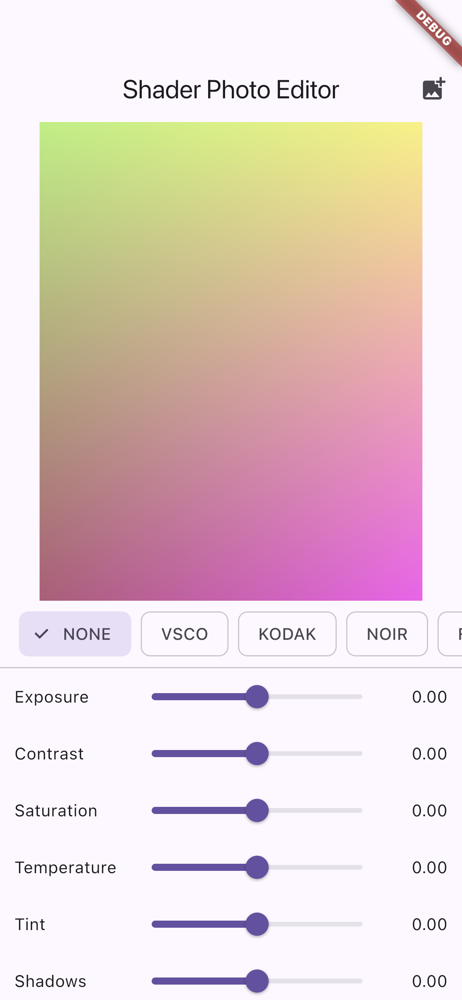
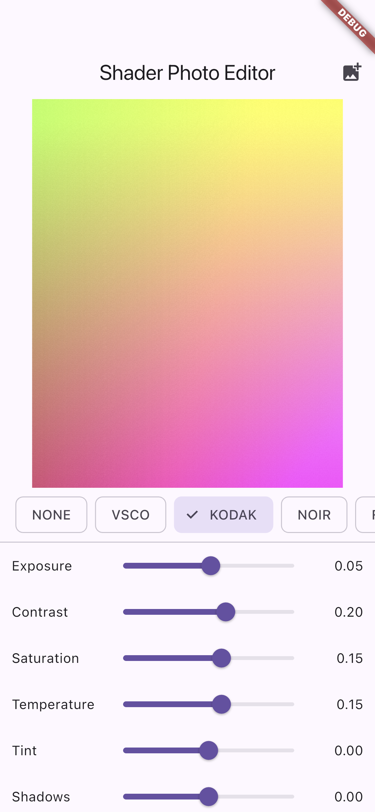
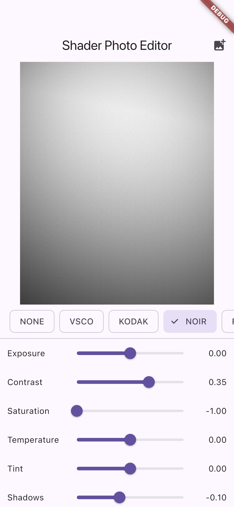
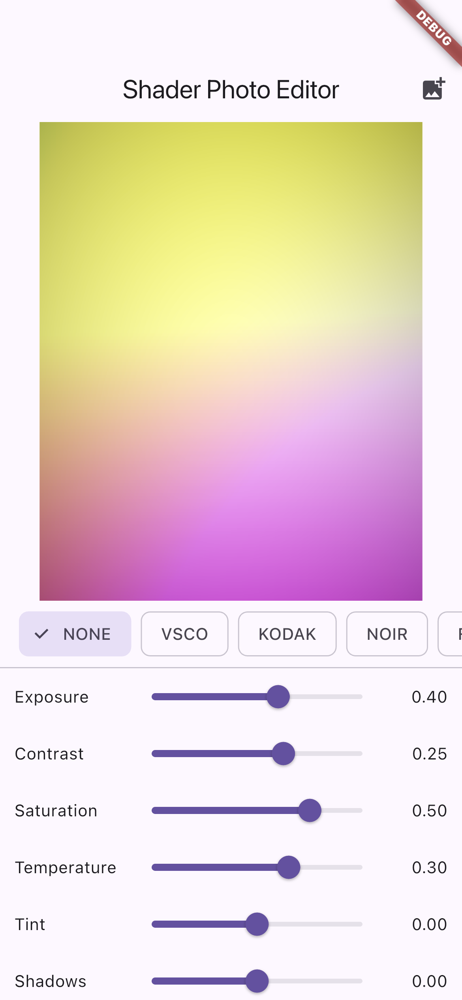
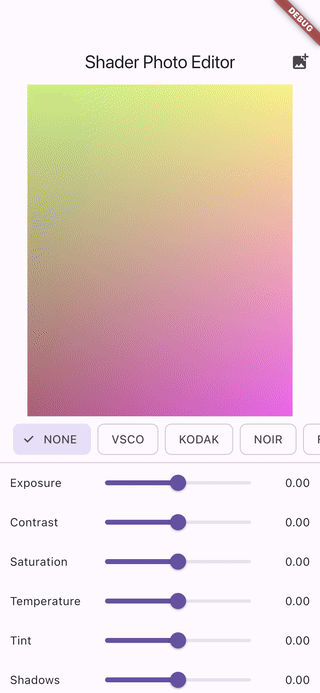

# Flutter Image Editor - Shader-Based Filters

Cross-platform photo editor POC. Real-time, GPU-accelerated tone + color filters using Flutter's `FragmentProgram` (GLSL). Portable analogue to iOS Core Image / Metal `CIColorCube` pipelines, with the same building blocks (per-pixel ops on the GPU, 3D LUT sampling, tone curves, grain) running on both iOS and Android from a single Dart codebase.

## Demo

Real iOS-Simulator captures of the running app (not mockups). See [FLOW.md](FLOW.md) for how they were generated.

| Editor loaded | Kodak preset | Noir preset | Manual edit |
|---|---|---|---|
|  |  |  |  |



## Why this POC

Mirrors what a senior iOS image-processing engineer would build with Core Image + Metal:
- Per-pixel exposure / contrast / saturation / temperature / tint
- Highlight + shadow tone-curve push
- 3D LUT sampling (8x8 quad-tiled 512x512 atlas, identical layout to common `CIColorCube` exports)
- Film grain (hash-based noise)
- Vignette
- VSCO / Kodak / Noir / Fade presets

Shader runs per-frame, so slider adjustments are instant - no CPU-bound `Image.memory` rebuilds.

## Stack

- Flutter 3.x + Dart 3.x
- `flutter_riverpod` (state)
- `image_picker` (gallery import)
- GLSL fragment shader via `ui.FragmentProgram.fromAsset`
- Runtime-generated identity LUT (drop a real PNG LUT into `assets/luts/` to swap in a film emulation)

## Files

- `shaders/filter.frag` - GLSL: exposure, contrast, saturation, temp/tint, tone curve, LUT, grain, vignette
- `lib/main.dart` - Riverpod state, `CustomPaint` shader painter, sliders + preset bar
- `pubspec.yaml` - declares the shader + LUT asset directory

## Run

```bash
flutter pub get
flutter run
```

Pick a photo, tweak sliders, tap a preset.

## Mapping to iOS Core Image / Metal

| Core Image / Metal                        | This POC                               |
|-------------------------------------------|----------------------------------------|
| `CIExposureAdjust`                        | `uExposure`, `pow(2.0, e)`             |
| `CIColorControls` (contrast/saturation)   | `uContrast`, `uSaturation`             |
| `CITemperatureAndTint`                    | `uTemperature`, `uTint`                |
| `CIHighlightShadowAdjust`                 | `uShadows`, `uHighlights` + luma mask  |
| `CIColorCube` (3D LUT)                    | `applyLut()` with 8x8 quad atlas       |
| `MTKView` real-time render                | `CustomPaint` + `FragmentShader`       |

## Author

Built by Hau Tran ([github.com/tranthienhau](https://github.com/tranthienhau)) as a portfolio POC for image-processing / photo-editor freelance work.
